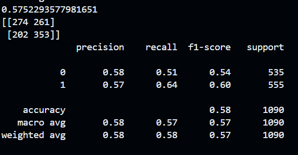

# Veloria Tech — ML Intern Assignment
**Submitted by:** Shreshank Kesharwani
**Date:** 06 June 2026
**Email:** shivankkesharwani4@gmail.com

---

## Overview

This repository contains my submission for the Veloria Tech AI/ML Engineering Internship assignment. It includes a cricket data web scraper, a match outcome prediction model, and a semantic search system built with vector embeddings.

---

## Repository Structure

```
veloria-tech-ml-intern-assignment/
│
├── trails              # Experiments done before writing final code
├── trials/matches.csv  # Used in models and rag implementation
├── requirements.txt    # To Downnload all necessary libraries
├── scraper.py          # Task 1 — Web scraping script
├── match_data.csv      # Task 1 — Scraped match data output
├── model.py            # Task 2 — ML prediction model code
├── model.pkl           # Task 2 — ML prediction model
├── rag_search.py       # Task 3 — Semantic search with vector embeddings
└── README.md           # This file
```

---

## Setup — Install Dependencies

Make sure you have Python 3.8+ installed, then run:

```bash
pip install -r requirements.txt
```

---

## Task 1 — Web Scraping (`scraper.py`)

### What it does
Scrapes the ipl 2026 cricket matches from [ESPNCricinfo].

For each match, it collects:
- `Match_no` | Match identifier (e.g., "1st Match", "Final") |
- `Date` | Date of the match (YYYY-MM-DD) |
- `Team1` | Home / first team |
- `Team2` | Away / second team |
- `Venue` | Stadium and city |
- `Winning_team` | Winner of the match (includes Super Over results) |
- `Player_of_match` | Player awarded Man of the Match |
- `Player_of_match_total_impact` | Impact score of the Player of the Match |
- `Top_scorer` | Highest run-scorer in the match |
- `Top_scorer_runs` | Runs scored by the top scorer |

Results are saved to `match_data.csv`.

### How to run

- Create a datas and trials/data(for Experiments.ipynb) folder

```bash
python scraper.py
```

**Output:** `match_data.csv` in the same directory.

---

## Task 2 — ML Prediction Model (`model.py`)

### What it does
Loads `trials/matches.csv`, engineers features, trains a classification model to predict match outcomes, and evaluates performance.

### Algorithm used
**[Logistic Regression]**

*Reason:* Logistic Regression was chosen as a clean baseline given the small dataset size. It is interpretable and performs well on binary classification tasks.

### Features used
- venue
- main_team
- opposing_team
- toss_decision
- main_team_won_toss

### How to run

```bash
python model.py
```

### Results

| Metric | Score1 | Score2 |
|--------|-------|-------|
| Accuracy | 57(training) | 52(test) |
| F1 Score | 57(training) | 52(test) |

**Confusion Matrix:**

```
[[274 261]
 [202 353]]

[[55 55]
 [44 64]]
```

> 

---

## Task 3 (Bonus) — Semantic Search (`rag_search.py`)

### What it does
Converts each match record into a descriptive text sentence, generates vector embeddings using `sentence-transformers`, stores them in ChromaDB, and allows semantic queries to retrieve the most relevant matches.

### How to run

```bash
python rag_search.py
```

You will be prompted to enter a search query. Example:

```
Enter your search query: Show me winner of 2023 ipl
```

**Output(using query):** Top 10 most semantically similar match records.
**Output(using run):** Perform retrival QuestionAnswer using llm.

### How it works
1. Each row in `trials/matches.csv` is converted into a natural language sentence — e.g. *"RCB vs MI Finals on 2023 MI won top scorer dhoni most runs 200"*
2. `sentence-transformers` (model: `BAAI/bge-large-en-v1.5`) encodes each sentence into a dense vector.
3. Vectors are stored in a ChromaDB in-memory collection.
4. On query, the query string is also embedded and cosine similarity is used to retrieve the top 10 matches.
5. On run, it will use `meta-llama/Llama-3.2-1B-Instruct` to perform retrival QuestionAnswer
---

## Challenges Faced

- Website structure changed — had to adjust CSS selectors
- Small dataset and features size limited model accuracy
- continous changes in genai documentation and codes

---

## Demo Video

🎥 **Loom walkthrough:** [Loom link]

---

## Contact

[Shreshank Kesharwani] — [shivankkesharwani4@gmail.com] — [9165016666]
